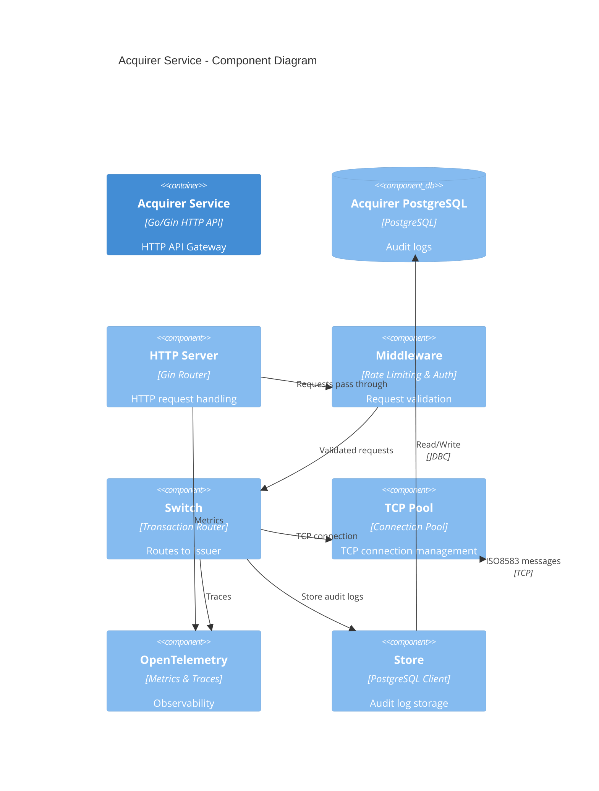
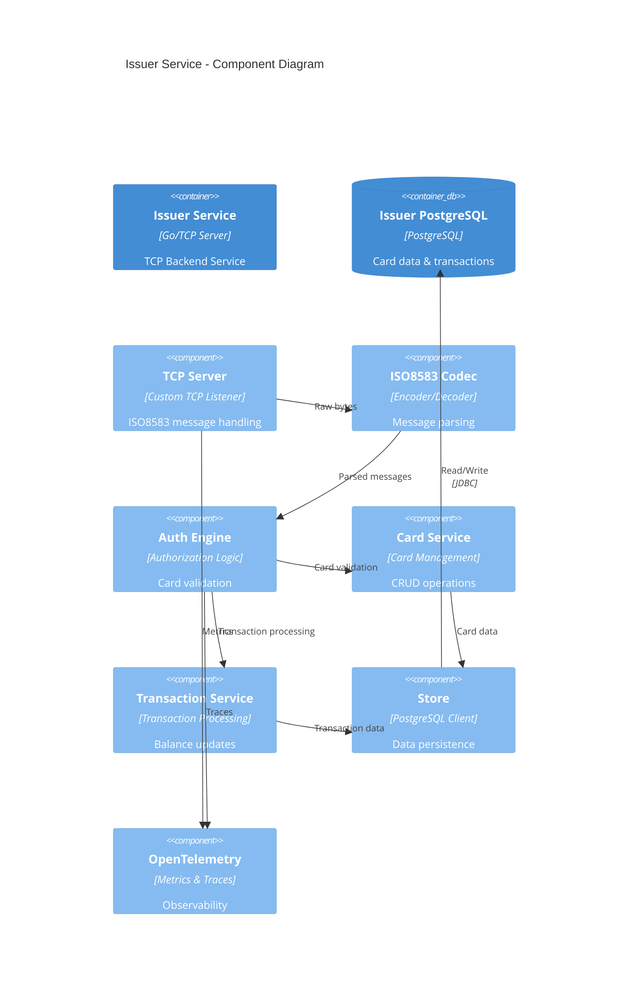

# C4 Model - Component Diagram

## Level 3: Component Diagram

### Acquirer Service Components

### Issuer Service Components

## Component Descriptions

### Acquirer Service Components

#### HTTP Server
- **Technology**: Gin framework
- **Purpose**: HTTP request handling and routing
- **Responsibilities**:
  - HTTP request parsing
  - Response formatting
  - Static file serving (Web UI)
  - Health check endpoint

#### Middleware
- **Technology**: Gin middleware
- **Purpose**: Request validation and rate limiting
- **Responsibilities**:
  - Request validation
  - Rate limiting (backpressure)
  - Queue management
  - Timeout handling
  - Request logging

#### Switch
- **Technology**: Custom Go implementation
- **Purpose**: Transaction routing to Issuer
- **Responsibilities**:
  - Transaction validation
  - ISO8583 message preparation
  - TCP connection management
  - Response handling
  - Error handling

#### TCP Pool
- **Technology**: Custom connection pool
- **Purpose**: TCP connection management to Issuer
- **Responsibilities**:
  - Connection pooling
  - Connection reuse
  - Connection health checks
  - Load balancing

#### OpenTelemetry
- **Technology**: OpenTelemetry Go SDK
- **Purpose**: Metrics and distributed tracing
- **Responsibilities**:
  - Metrics collection (Prometheus format)
  - Distributed tracing (OTLP)
  - Performance monitoring
  - Error tracking

#### Store
- **Technology**: PostgreSQL client with connection pooling
- **Purpose**: Audit log storage
- **Responsibilities**:
  - Transaction audit logging
  - Query execution
  - Connection management
  - Transaction handling

### Issuer Service Components

#### TCP Server
- **Technology**: Custom TCP listener
- **Purpose**: ISO8583 message handling
- **Responsibilities**:
  - TCP connection acceptance
  - Message buffering
  - Connection management
  - Response sending

#### ISO8583 Codec
- **Technology**: moov-io/iso8583 library
- **Purpose**: Message encoding/decoding
- **Responsibilities**:
  - ISO8583 message parsing
  - Field validation
  - Bitmap generation
  - Message serialization

#### Auth Engine
- **Technology**: Custom Go implementation
- **Purpose**: Authorization logic
- **Responsibilities**:
  - Card validation (Luhn check)
  - PIN verification
  - Balance checking
  - Response code generation
  - Processing code validation

#### Card Service
- **Technology**: Custom Go service
- **Purpose**: Card management
- **Responsibilities**:
  - Card creation
  - Card retrieval
  - Balance updates
  - Card validation

#### Transaction Service
- **Technology**: Custom Go service
- **Purpose**: Transaction processing
- **Responsibilities**:
  - Transaction creation
  - Balance updates
  - Transaction history
  - Response generation

#### Store
- **Technology**: PostgreSQL client with connection pooling
- **Purpose**: Data persistence
- **Responsibilities**:
  - Card data storage
  - Transaction storage
  - Query execution
  - Migration management

#### OpenTelemetry
- **Technology**: OpenTelemetry Go SDK
- **Purpose**: Metrics and distributed tracing
- **Responsibilities**:
  - Metrics collection (Prometheus format)
  - Distributed tracing (OTLP)
  - Performance monitoring
  - Error tracking

## Data Flow

### Transaction Request Flow (Acquirer)
1. **User** → HTTP Server: HTTP POST request
2. **HTTP Server** → Middleware: Request validation
3. **Middleware** → Switch: Validated transaction
4. **Switch** → TCP Pool: Get connection
5. **TCP Pool** → Issuer: ISO8583 TCP message
6. **Switch** → Store: Audit log
7. **Store** → Acquirer DB: Store audit log
8. **HTTP Server** → User: HTTP response

### Transaction Processing Flow (Issuer)
1. **TCP Server** → Codec: Raw bytes
2. **Codec** → Auth Engine: Parsed ISO8583 message
3. **Auth Engine** → Card Service: Validate card
4. **Card Service** → Store: Retrieve card data
5. **Store** → Issuer DB: Query card
6. **Auth Engine** → Transaction Service: Process transaction
7. **Transaction Service** → Store: Update balance
8. **Store** → Issuer DB: Update card balance
9. **Auth Engine** → Codec: Response message
10. **Codec** → TCP Server: Response bytes
11. **TCP Server** → Acquirer: TCP response

## Technology Stack

### Acquirer Service
- **Language**: Go 1.21+
- **Web Framework**: Gin
- **Database**: PostgreSQL 16
- **Observability**: OpenTelemetry
- **Protocol**: HTTP/1.1, TCP

### Issuer Service
- **Language**: Go 1.21+
- **TCP Server**: Custom implementation
- **Database**: PostgreSQL 16
- **ISO8583**: moov-io/iso8583
- **Observability**: OpenTelemetry
- **Protocol**: TCP

### Web UI
- **Language**: Vanilla JavaScript
- **Styling**: Tailwind CSS
- **Protocol**: HTTP/1.1
