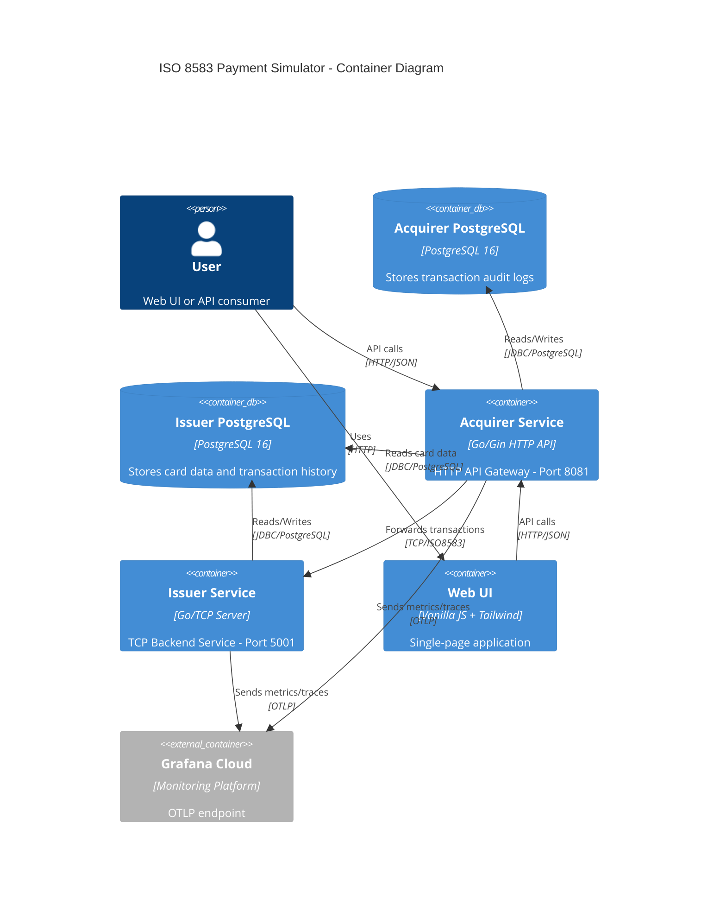

# C4 Model - Container Diagram

## Level 2: Container Diagram

## Container Descriptions

### Acquirer Service
- **Technology**: Go with Gin framework
- **Port**: 8081 (HTTP)
- **Purpose**: HTTP API Gateway that receives transaction requests from clients
- **Responsibilities**:
  - HTTP request handling
  - Transaction validation
  - Backpressure management (rate limiting, queue)
  - Forwarding transactions to Issuer via TCP
  - Storing audit logs in Acquirer PostgreSQL
  - OpenTelemetry metrics and traces

### Issuer Service
- **Technology**: Go with custom TCP server
- **Port**: 5001 (TCP)
- **Purpose**: Backend service that processes transactions and manages card data
- **Responsibilities**:
  - TCP/ISO8583 message processing
  - Card validation and authorization
  - Balance management
  - Transaction processing
  - Storing card data and transactions in Issuer PostgreSQL
  - OpenTelemetry metrics and traces

### Web UI
- **Technology**: Vanilla JavaScript + Tailwind CSS
- **Purpose**: Single-page application for transaction testing
- **Responsibilities**:
  - Transaction form input
  - Card management
  - Transaction history display
  - Real-time message encoding/decoding
  - ISO8583 specification display

### Acquirer PostgreSQL
- **Technology**: PostgreSQL 16
- **Port**: 5433
- **Purpose**: Stores transaction audit logs
- **Data**: Transaction records, timestamps, response codes

### Issuer PostgreSQL
- **Technology**: PostgreSQL 16
- **Port**: 5432
- **Purpose**: Stores card data and transaction history
- **Data**: Card information, balances, transaction records

### Grafana Cloud
- **Technology**: Grafana Cloud
- **Purpose**: Monitoring and observability
- **Data**: Metrics (Prometheus), Traces (Tempo), Logs (Loki)

## Communication Patterns

### HTTP Communication
- **User → Web UI**: HTTP requests for UI assets
- **User → Acquirer**: REST API calls for transactions
- **Web UI → Acquirer**: AJAX calls for transaction processing

### TCP Communication
- **Acquirer → Issuer**: ISO8583 messages over TCP protocol

### Database Communication
- **Acquirer → Acquirer DB**: Read/write audit logs
- **Acquirer → Issuer DB**: Read-only card data access
- **Issuer → Issuer DB**: Read/write card data and transactions

### Observability
- **Acquirer → Grafana**: OTLP metrics and traces
- **Issuer → Grafana**: OTLP metrics and traces
