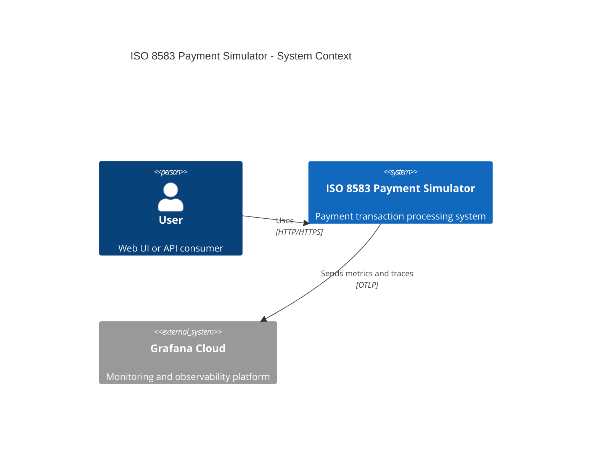

# C4 Model - Context Diagram

## Level 1: System Context

## Description

The ISO 8583 Payment Simulator is a microservices-based system that simulates payment transaction processing between acquirers and issuers using the ISO 8583 protocol.

### External Systems

- **User**: Interacts with the system via web UI or HTTP API to process transactions
- **Grafana Cloud**: Receives metrics and distributed traces for monitoring and observability

### Key Interactions

1. **User → Payment Simulator**
   - Web UI: HTTP requests to port 8081
   - API: REST endpoints for transaction processing
   - Protocol: HTTP/HTTPS

2. **Payment Simulator → Grafana Cloud**
   - Metrics: Prometheus format (every 15s)
   - Traces: OpenTelemetry (1% sampling)
   - Protocol: OTLP over HTTP/HTTPS
